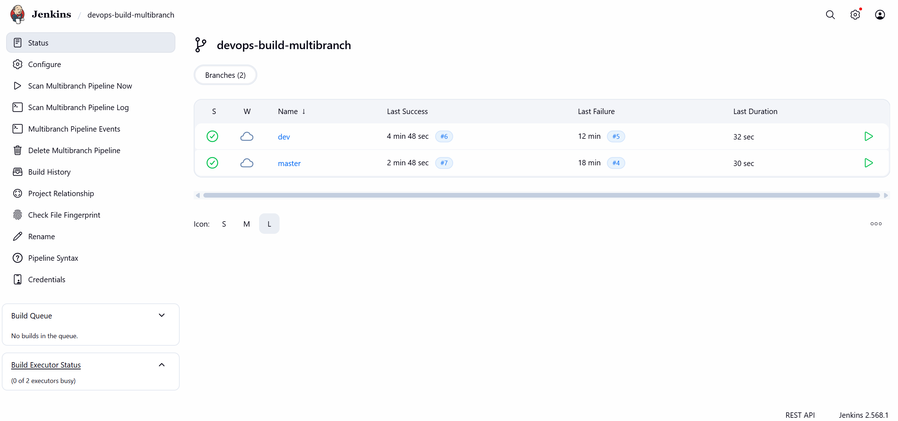
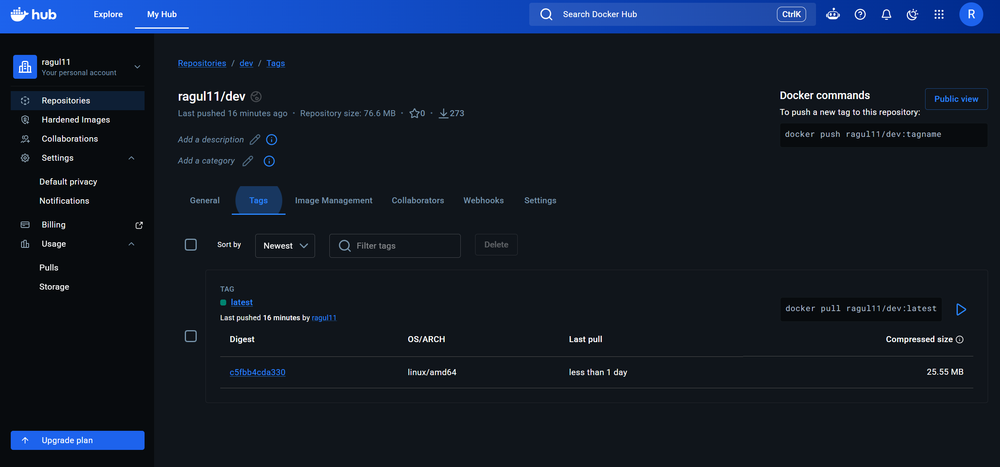
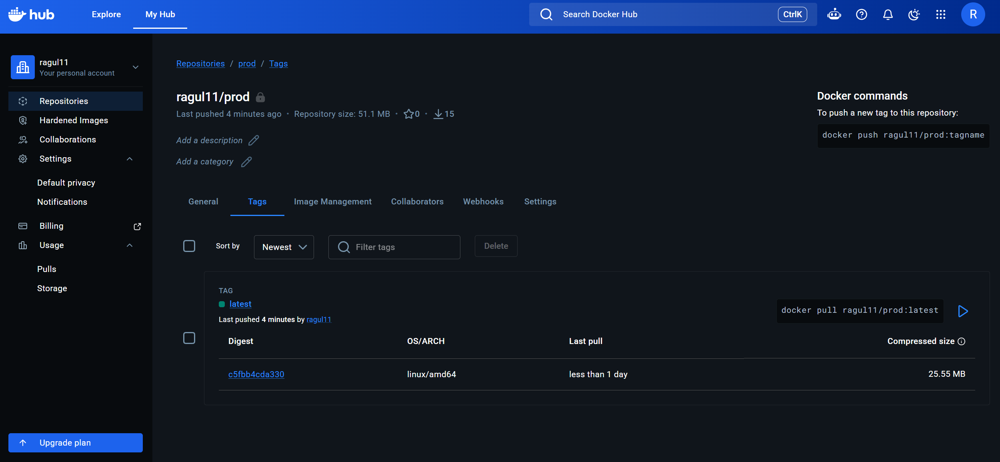
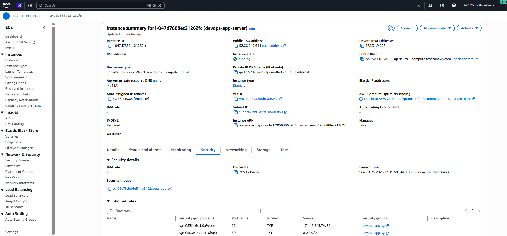
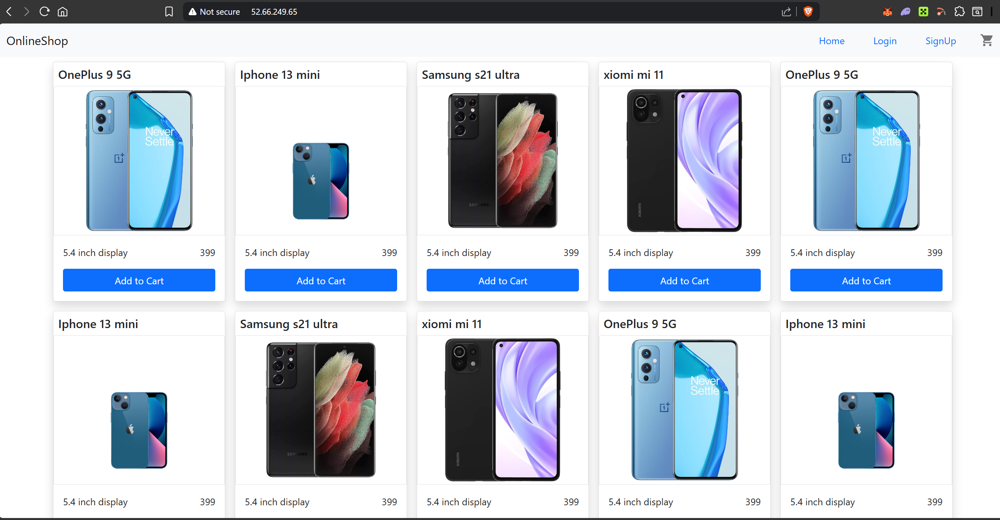
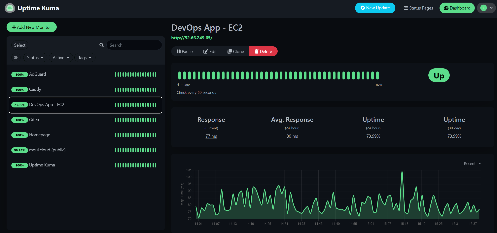
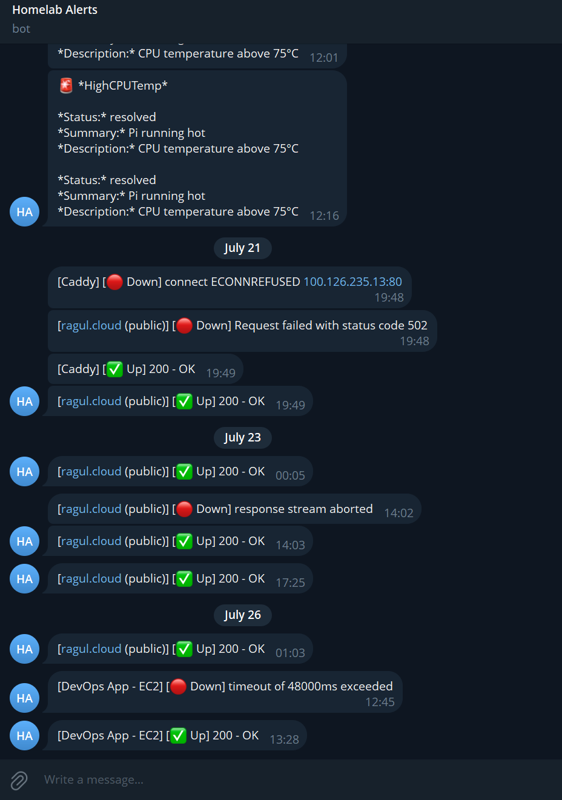

 

# CI/CD Application Deployment — Dockerized React App on AWS

A production-style CI/CD pipeline: a Dockerized React app is built, tested, and deployed automatically via Jenkins, with branch-based promotion between a public "dev" registry and a private "prod" registry, running on AWS EC2 and monitored with alerting.

Secondary project — see [homelab](https://github.com/ragull-11/homelab) for the primary self-hosted infrastructure project.

**Live site:** not kept running continuously — the EC2 instance is started only when actively demoing or testing, to avoid ongoing AWS cost for a portfolio project. Screenshots below show it live and working.

**Jenkins CI/CD:** runs on the homelab's Raspberry Pi, reachable over Tailscale

**Docker images:** [`ragul11/dev`](https://hub.docker.com/r/ragul11/dev) (public) · `ragul11/prod` (private)

---

## Architecture

GitHub (dev / master branches)

&nbsp;&nbsp;&nbsp;&nbsp;│  polled every 2 min

&nbsp;&nbsp;&nbsp;&nbsp;▼

Jenkins (Multibranch Pipeline, on homelab Pi)

&nbsp;&nbsp;&nbsp;&nbsp;│

&nbsp;&nbsp;&nbsp;&nbsp;├─ build.sh → Docker image (cross-built for linux/amd64)

&nbsp;&nbsp;&nbsp;&nbsp;│

&nbsp;&nbsp;&nbsp;&nbsp;├─ dev branch    → push → ragul11/dev   (public)

&nbsp;&nbsp;&nbsp;&nbsp;└─ master branch → push → ragul11/prod  (private)

&nbsp;&nbsp;&nbsp;&nbsp;│

&nbsp;&nbsp;&nbsp;&nbsp;▼

AWS EC2 (t2.micro) — pulls image, redeploys container

&nbsp;&nbsp;&nbsp;&nbsp;│

&nbsp;&nbsp;&nbsp;&nbsp;▼

Uptime Kuma → Telegram alerts (self-hosted, on the same Pi)

## Stack

- **App:** pre-built static React (create-react-app) bundle, served via nginx

- **Containerization:** Docker, Docker Compose

- **CI/CD:** Jenkins Multibranch Pipeline (native install, not containerized), polling-based triggers

- **Registry:** Docker Hub — separate public (`dev`) and private (`prod`) repositories

- **Cloud:** AWS EC2 (t2.micro), Security Groups scoped to least privilege

- **Monitoring:** Uptime Kuma + Telegram alerting (reused from the homelab project)

## How the pipeline works

1. Push to `dev` → Jenkins detects the change (polling, ~2 min) → builds the image → tags and pushes to `ragul11/dev` (public) → deploys to EC2

2. Once `dev` is stable, merge into `master` → same pipeline runs → tags and pushes to `ragul11/prod` (private) → deploys to EC2

3. Deployment happens over SSH from Jenkins to the EC2 instance, pulling the freshly pushed image and restarting the container

## Screenshots

**Jenkins — branch-based CI/CD, both branches building independently**

**Docker Hub — dev (public) and prod (private), timestamps confirming branch-based routing**

**AWS EC2 — instance details and Security Group rules**

**Deployed application, live**

**Monitoring — Uptime Kuma tracking the deployed app**

**Telegram alerts — down and recovery notifications**

## Design decisions worth knowing

- **Static app, not source:** the upstream repo provides a pre-built React bundle, not source code — the Dockerfile serves it directly via nginx rather than running a build step. A custom nginx config handles client-side routing (`try_files` fallback to `index.html`).

- **Cross-platform builds:** Jenkins runs on an ARM64 Raspberry Pi, but the EC2 target is amd64. `docker buildx` with QEMU emulation builds the correct architecture for deployment.

- **No Elastic IP:** to avoid unnecessary AWS cost, the EC2 instance is stopped between uses rather than left running continuously. This means its public IP changes on every restart — `EC2_HOST` in the Jenkinsfile and the Security Group's SSH rule are updated manually when that happens.

- **`deploy.sh` vs. the pipeline's deploy step:** `deploy.sh` is a standalone script for a manual deploy; Jenkins' pipeline reimplements the same logic inline over SSH because it needs branch-aware image tag selection that a plain script argument doesn't express.

- **Known limitation:** if `dev` and `master` are both deployed to the same EC2 instance within seconds of each other, a container-name race condition can occur. Not an issue in normal usage; the fix (a Jenkins lock around the deploy stage) is understood but not yet implemented.

## Repo structure

    build/              — pre-built React app (static files)

    Dockerfile

    nginx.conf

    docker-compose.yml

    build.sh

    deploy.sh

    Jenkinsfile

    .dockerignore

